# Managing RFID access

## Accessing SecBot
ssh to the-gibson inside the space as usual

```
$ ssh the-gibson
```

Run the secbot command from the commandline

```
$ secbot
```

It takes a few seconds to load.

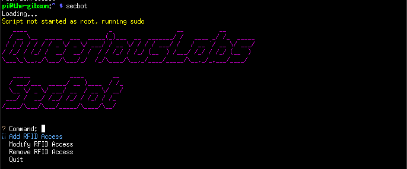

## Adding a new RFID
Adding a new RFID is a 6 step process requiring the input of the RFID value, the access level, and a sponsor.  If you are adding a new RFID, you are the sponsor, and as a sponsor, it is your responsability to track who belongs to which RFID.

Steps:
1. Input the new RFID code (use the scanner)
2. Select the access level (e.g. 24 hour access or daytime only)
3. Select the sponsor, i.e. you who is adding and responsible for the RFID
4. Confirm the information, which does not, yet, save the information
5. Commit the Changes which saves them to disk
6. Confirm the commit

If you attempt to exit with unsaved changes, you will be prompted to save or discard them.

Graphical Steps:
1. Input the new RFID code (use the scanner)

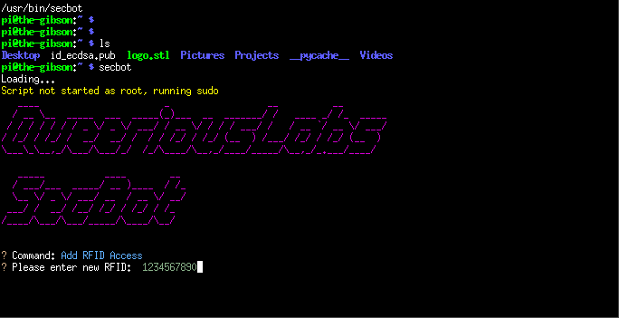

2. Select the access level (e.g. 24 hour access or daytime only)

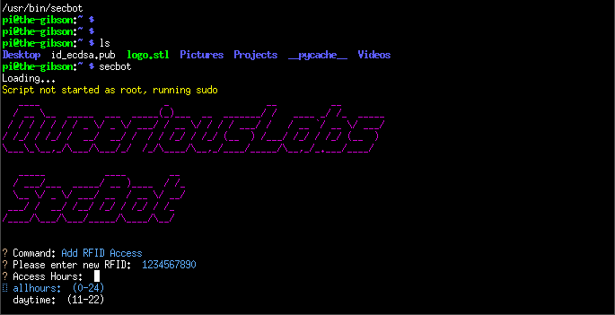

3. Select the sponsor, i.e. you who is adding and responsible for the RFID

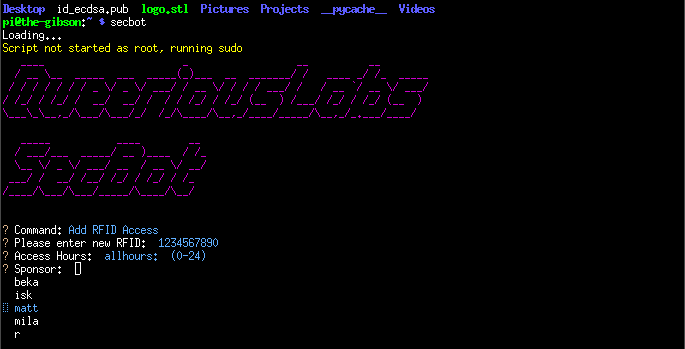

4. Confirm the information, which does not, yet, save the information

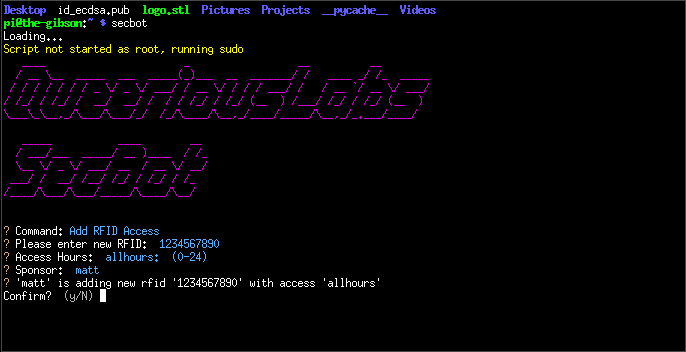

5. Commit the Changes which saves them to disk

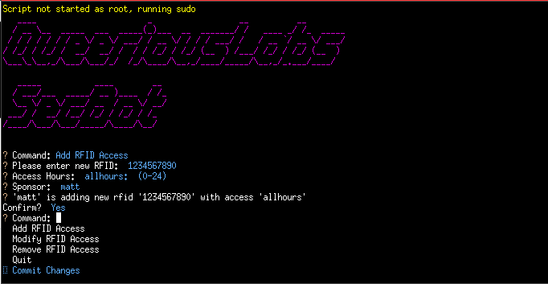

6. Confirm the commit

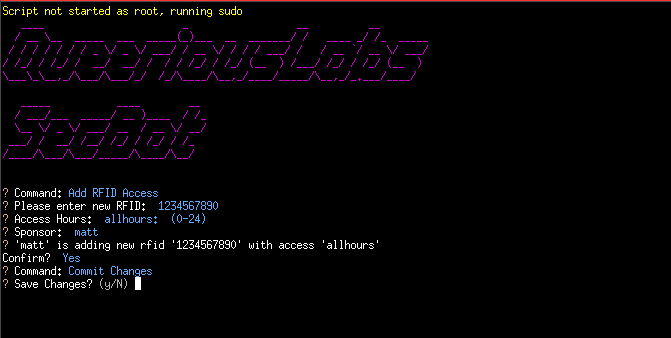


## Removing RFID access
Removing RFID access removes the record from teh system entirely.

1. Enter the RFID you wish to remove

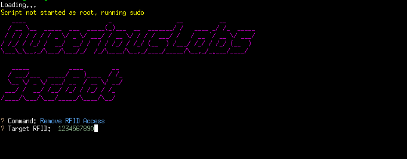

2. Confirm the target RFID to remove

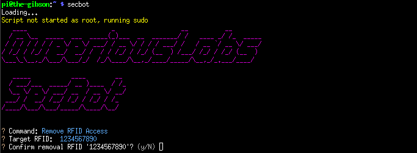


3. Commit Changes via menu or by quitting and confirming the changes

## Modifying RFID
An RFID may be assigned new access level or a new sponsor through a modification.

1. Enter the RFID to modify
2. Select the access level or leave the existing one
3. Select the new sponsor or leave the existing one
4. Commmit Changes

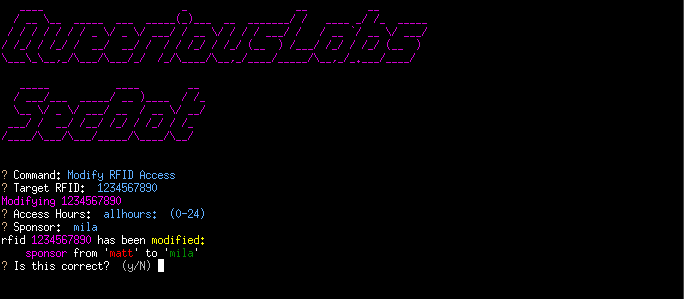

## Commit Changes
When a change has been introduced via adding, modifying, or removing and RFID, a new menu item is available to Commit Changes.  

When confirming the commit of changes, you will see messages indicating the changes are saved and the authorizer is notified.  Assuming both are successful, the authorizer reloads the access control list and the changes take immediate effect.

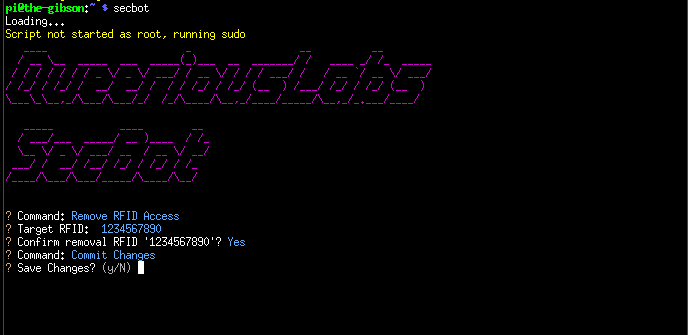

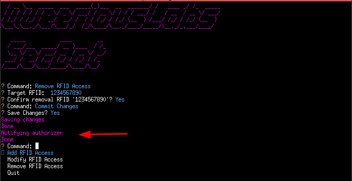


If the saving succeeds and the notification fails, that's fine.  The authorizer may not be running or may need to be restarted manually.

If the saving fails, something is quite wrong and ought to be debugged.  Feel free to try again, it's possible (though unlikely) the rfids file is corrupt.

# Premptive Answers
## How do I add a new sponsor?
At the moment this is not managed automatically.  IF you edit the `rfids.csv` file, you can modify an existing sponsor to the new sponsor.  for example if elevating user `purple` from someone with access to a sponsor, find their rfid and change their sponsor to `purple`.  The existence of `purple` in the sponsor field means `purple` will be available as a sponsor in the future.

## How do I add new access permissions / new components of the system?
That's more development and not the purpose of this manual.

## I'd like to request a feature or report a bug
Please raise an issue on http://github.com/queeriouslabs/100101SecBot.  If you don't get traction, hit up the discord.  Even better, fix it and send a PR.

# Technical Details
Secbot currently resides in `/home/marcidy/100101SecBot`.  This may change to reside in `/home/pi` or `/root`.  There is a minimal bash script in `100101SEcBot/bin` which is symlinked to `/usr/bin/secbot`:

```
$ which secbot
/usr/bin/secbot
```

This symlink makes the secbot program available to all users.  

`secbot` requires sudo, and will ask if launched without it.   Users with "no password sudo" should see privileges escalate automatically, which others will be asked for the password.

Inside the 100101SecBot directory, there is a `data/` folder which holds the access levels (`hours.csv`) and the rfid data (`rfids.csv`).  Modifying these files directly is a Bad Idea except when it's absolutely necessary.

`rfids.csv` requires a header with 3 colums of labels and each row requires 3 comma-separated values for rfid, access level, and sponsor.

e.g.:

```
rfid,access_times,sponsor
1234653435,allhours,beka
9976223446,allhours,beka
0099887776,allhours,beka
```

Any string in the `sponsor` column is used in the `secbot` program for sponsor selection.  The list is created by the unique entries in this file and not stored separately.

Secbot attempts to notify the `front_door_authorizer` service when committing changes.  This is handled by connecting to the unix domain socket in `/run/queeriouslabs/authorizer.sock`.  If this is not available, that step can fail, but the files will still be updated.

The authorizer is part of the suite of services which control the front door access, manged with systemd.
```
$ systemctl restart front_door_rfid_reader front_door_authorizer front_door_latch
```

Logs for secbot specifically aren't kept, though the notification to the authorizer may be inspected in the logs at `/var/log/queeriouslabs/acl.log`.
